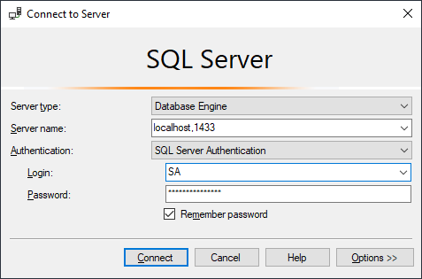
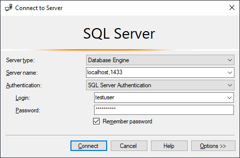

# Microsoft SQL Server connection source codes
Small example console source codes how to connect to the Microsoft SQL Server, how to update rows and how to read the table.

## Running under Windows
1. clone this repository to your computer
2. install the **Microsoft SQL Server** (as a **Docker** container)
3. prepare the user, the table and rows in the database
4. build and run the example **Java** code
5. compile and run the example **.NET C#** code
6. run the example **PHP** code

### 1. Cloning to your computer
- install [GIT] on your computer
- clone this repository to your computer by the GIT command
  `git clone https://github.com/petrfaltus/ms-sql-server-connection-source-codes.git`

### 2. Installation of the Microsoft SQL Server (as a Docker container)
- install [docker desktop] on your computer
- refer the [Microsoft SQL Server image]

The subdirectory `docker-database` contains prepared Windows batches:
- `01-run-database.cmd` - pulls the image and runs the container **at the first time**
- `02-switch-database-OFF.cmd` - stops the already existing container
- `02-switch-database-ON.cmd` - starts the already existing container
- `03-inspect-database.cmd` - shows details for already existing container
- `04-exec-connection-to-database-sa.cmd` - executes the **sqlcmd tool** terminal into running database container (as the user *sa*)
- `04-exec-connection-to-database-testuser.cmd` - executes the **sqlcmd tool** terminal into running database container (as the user *testuser*)
- `containers.cmd` - lists currently running containers and list of all existing containers

### 3. Preparing the database
For the connection to the database use either the **sqlcmd tool** terminal or the [Microsoft SQL Server Management Studio]

#### Connection using sqlcmd tool
Use prepared Windows batches, every SQL command terminate by the keyword **GO**
```sql
SELECT @@version;
GO
```

#### Connection using Microsoft SQL Server Management Studio
User *sa* (default password *Syst3mAdm1n!*)



User *testuser* (default password *T3stUs3r!*)



#### SQL lines for sa
```sql
CREATE DATABASE testdb;
USE testdb;

CREATE LOGIN testuser WITH PASSWORD = 'T3stUs3r!';
CREATE USER testuser FOR LOGIN testuser;

GRANT SELECT TO testuser;
GRANT CREATE TABLE TO testuser;
GRANT INSERT TO testuser;
GRANT UPDATE TO testuser;
GRANT ALTER TO testuser;

ALTER LOGIN testuser WITH DEFAULT_DATABASE=testdb;
```

#### SQL lines for testuser
```sql
USE testdb;

CREATE TABLE animals (
  name VARCHAR(40) NOT NULL,
  legs TINYINT NOT NULL,
  created DATETIME DEFAULT GETDATE(),
  updated DATETIME,
  remark VARCHAR(80),
  id INT IDENTITY(1,1) PRIMARY KEY NOT NULL
);

CREATE TRIGGER animals_update
  ON animals
  AFTER UPDATE
AS 
BEGIN
    SET NOCOUNT ON;
    UPDATE animals
    SET updated = GETDATE()
    WHERE id IN (SELECT id FROM Inserted)
END;

INSERT INTO animals (name, legs) VALUES ('chicken', 2);
INSERT INTO animals (name, legs) VALUES ('fox', 4);
INSERT INTO animals (name, legs) VALUES ('eagle', 2);
INSERT INTO animals (name, legs) VALUES ('ant', 6);
INSERT INTO animals (name, legs) VALUES ('horse', 4);
```

### 4. The Java client source code
- install [Java JDK] on your computer
- set the OS environment `%JAVA_HOME%` variable (must exist `"%JAVA_HOME%\bin\java.exe"`)

#### 4.1. Apache Maven
- install [Apache Maven] on your computer
- add the Maven directory (where the batch `mvn.cmd` locates) to the OS environment `%PATH%` variable

The subdirectory `java-maven` contains prepared Windows batches:
- `01-build.cmd` - cleans, compiles and builds the Maven project
- `02-run.cmd` - runs the built Java archive (JAR)
- `03-clean.cmd` - cleans the Maven project

#### 4.2. Gradle Build Tool
- install [Gradle Build Tool] on your computer
- add the Gradle directory (where the batch `gradle.bat` locates) to the OS environment `%PATH%` variable

The subdirectory `java-gradle` contains prepared Windows batches:
- `01-build.cmd` - cleans, compiles and builds the Gradle project
- `02-run.cmd` - runs the built Java archive (JAR)
- `03-clean.cmd` - cleans the Gradle project

## Versions
Now in August 2020 I have the computer with **Windows 10 Pro 64bit**, **12GB RAM** and available **50GB free HDD space**

| Tool | Version | Setting |
| ------ | ------ | ------ |
| [GIT] | 2.26.0.windows.1 | |
| [docker desktop] | 2.3.0.4 (46911) stable | 2 CPUs, 3GB memory, 1GB swap, 48GB disc image size |
| [Microsoft SQL Server image] | 2017-CU8-ubuntu | password for sa: Syst3mAdm1n! |
| [Microsoft SQL Server Management Studio] | 18.6 | |
| [Java JDK] | 14.0.1 | Java(TM) SE Runtime Environment (build 14.0.1+7) |
| [Apache Maven] | 3.6.3 | |
| [Gradle Build Tool] | 6.3 | |

## To do (my plans to the future)


[GIT]: <https://git-scm.com>
[docker desktop]: <https://docs.docker.com/desktop/>
[Microsoft SQL Server image]: <https://hub.docker.com/_/microsoft-mssql-server>
[Microsoft SQL Server Management Studio]: <https://docs.microsoft.com/en-us/sql/tools/overview-sql-tools?view=sql-server-ver15>
[Java JDK]: <https://www.oracle.com/java/technologies/javase-downloads.html>
[Apache Maven]: <https://maven.apache.org/>
[Gradle Build Tool]: <https://gradle.org/>
